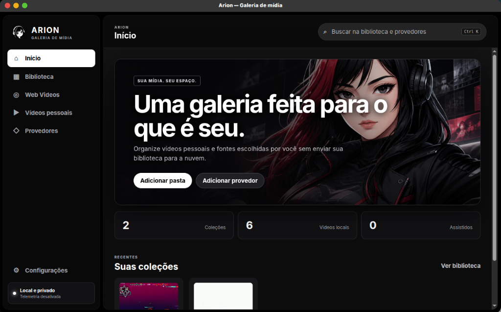
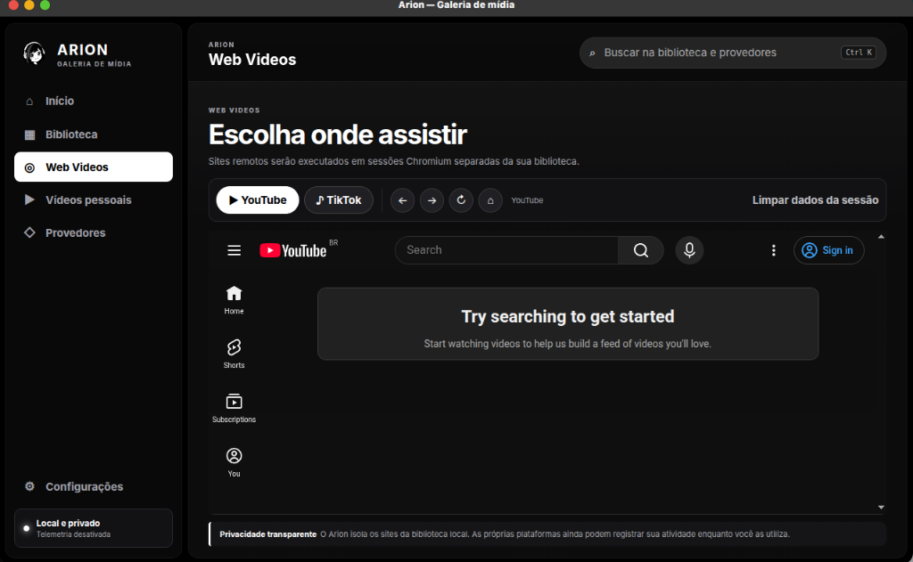
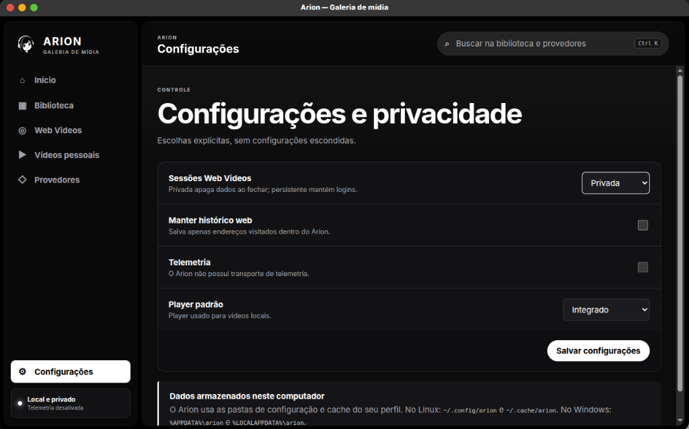

<div align="center">

**Language / Idioma:** [Português](READMEBR.md) | English


# Arion

**A local, private, and extensible media gallery for desktop.**

Arion organizes videos stored on your computer into collections and defines a neutral protocol (`arion-provider.json` + JSON-RPC 2.0) so metadata providers — local or web-based — can be chosen and connected by the user.

The core **does not** bundle a source catalog, **does not** recommend third-party services, and **does not** send your library to any cloud.

[](LICENSE)
[](https://github.com/kyuubyN/Arion-Project/releases)

</div>

## Table of contents

- [Interface](#interface)
- [Current state](#current-state)
- [Architecture overview](#architecture-overview)
- [Requirements](#requirements)
- [Running in development](#running-in-development)
- [Tests and verification](#tests-and-verification)
- [Local data](#local-data)
- [Providers](#providers)
- [Documentation](#documentation)
- [License](#license)

## Interface

<div align="center">

### Home & Media Library


<br><br>

### Web Videos (Isolated Sessions) & Settings

<br><br>


</div>

## Current state

| Area | Detail |
|---|---|
| Project | Independent Go module |
| Library | Generic model for collections and media items |
| Local discovery | Video scanning with **FFprobe**, thumbnail generation with **FFmpeg** |
| Playback | HTML5, **MPV**, and **Celluloid** |
| Local providers | Discovery and execution via `arion-provider.json` + **JSON-RPC 2.0** |
| Web providers | Opt-in, standardized HTTPS manifest — no scraping of arbitrary URLs |
| Development kit | Public Go kit, neutral sample server, and compliance validator for web providers |
| Search | Unified in three stages: immediate library results → quick preview → full enrichment from providers |
| External covers | Anti-SSRF validation, size/rate limiting, and local caching |
| API | Local, authenticated by an **ephemeral token** per session |
| Telemetry | Nonexistent — disabled by design, not by configuration |
| Desktop shell | Electron/Chromium with **isolated** web sessions for the `Web Videos` tab |
| Fallback | GTK 3 / WebKit2GTK when the Electron runtime isn't installed |
| Packaging | x64 packages for Linux and Windows, including a portable Windows executable |

## Architecture overview

```
┌─────────────┐      JSON-RPC 2.0       ┌──────────────────────┐
│   Go Core    │ ◄─────────────────────► │ Local providers        │
│  (library,   │      arion-provider.json│ (own process)          │
│   local API, │                         └──────────────────────┘
│   cache)     │      HTTPS + manifest   ┌──────────────────────┐
│              │ ◄─────────────────────► │ Web providers           │
└──────┬───────┘      /.well-known/...   │ (opt-in per domain)     │
       │                                 └──────────────────────┘
       │ Ephemeral token (local API)
       ▼
┌─────────────┐
│ Electron/Chromium shell │ ── fallback ── GTK3/WebKit2GTK
│ (UI, isolated sessions) │
└─────────────┘
```

- **Go core**: owns the library, the thumbnail/cover cache, and the authenticated local API.
- **Providers**: external processes or services, discovered only through a manifest — the core never contacts an origin without a valid manifest.
- **Shell**: presentation layer; the `Web Videos` tab runs in Chromium sessions isolated from the rest of the app.

Full details in [Architecture](docs/architecture.md) and [Data model](docs/data-model.md).

## Requirements

| Component | Needed for | Required |
|---|---|---|
| Go 1.22+ | Building the core | Yes |
| Node.js | Building/running the Electron shell | Yes |
| FFmpeg / FFprobe | Video metadata and thumbnails | Recommended |
| GTK 3 / WebKit2GTK | Fallback when Electron isn't installed | Fallback only |

## Running in development

```bash
npm install
./arion-launcher.sh
```

On Windows, use the installer or the portable executable published for the desired version in [Releases](https://github.com/kyuubyN/Arion-Project/releases).

For detailed requirements, per-platform data paths, and build instructions, see [Installation and development](docs/installation.md).

## Tests and verification

```bash
go test ./...          # unit/integration tests for the Go core
go vet ./...            # static analysis of the Go code
node --check frontend/app.js   # frontend syntax validation
npm run sbom             # project SBOM generation
```

## Local data

| Data type | Path |
|---|---|
| Settings and catalog | `~/.config/arion` |
| Thumbnails | `~/.cache/arion` |

Arion indexes **only** folders explicitly authorized by the user. Media files are never copied, moved, or uploaded off the machine.

## Providers

A provider is recognized solely by its **manifest**, never by heuristics or a loose URL:

- **Local providers**: discovered and executed via `arion-provider.json` and JSON-RPC 2.0 calls.
- **Web providers**: must expose `/.well-known/arion-provider.json` over HTTPS. Pasting a plain URL into the interface grants no privilege and triggers no scraping — without a valid manifest, there is no integration.

The core **contains no third-party-specific integrations**. Compatible adapters are developed outside the Arion repository and communicate with it exclusively through the public protocol.

Technical references:

- [Provider protocol (local)](docs/provider-protocol.md)
- [Web provider protocol](docs/website-provider-protocol.md)
- [Provider policy](PROVIDER_POLICY.md)
- [Provider development kit](docs/provider-development-kit.md)

## Documentation

| Document | Content |
|---|---|
| [Architecture](docs/architecture.md) | Internal components and data flow |
| [Installation and development](docs/installation.md) | Requirements, build, and per-platform paths |
| [Data model](docs/data-model.md) | Schema for collections, items, and metadata |
| [Web provider protocol](docs/website-provider-protocol.md) | HTTPS manifest specification |
| [Provider development kit](docs/provider-development-kit.md) | Go SDK, sample server, and compliance validator |
| [Web mode security](docs/security/web-mode.md) | Session isolation and shell attack surface |
| [Provider security](docs/security/providers.md) | Trust model and SSRF mitigation |
| [Reclone proof](docs/reclone-proof.md) | Build reproducibility verification |
| [Release checklist](docs/release-checklist.md) | Steps to publish a release |

## License

Arion is free software under the [GNU General Public License v3.0 only](LICENSE). Reused components and dependencies retain their own notices in [THIRD_PARTY_NOTICES.md](THIRD_PARTY_NOTICES.md).

<sub>Transparency: some images in Arion's visual identity were generated or transformed with AI assistance from the project's original materials.</sub>
